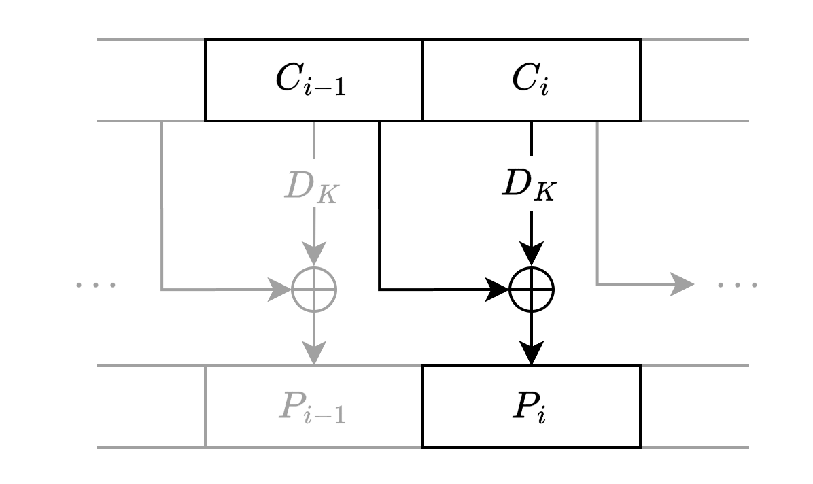
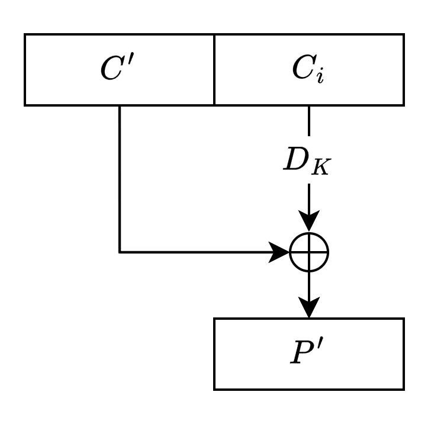

# One Byte Padding Oracle Attack

https://alpacahack.com/daily/challenges/one-byte-padding-oracle-attack

## 問題の概要

AES-CBC で暗号化されたフラグを Padding Oracle Attack で復号する問題です。

サーバーに接続するとランダムな `key` を使ってフラグを AES-CBC で暗号化した結果 (`iv` + `ciphertext`) が返されます。

サーバーに任意の `iv` + `ciphertext` を送信すると、先の `key` で復号した結果のパディングが正しいかどうかを `True` または `False` で答えてくれます。

フラグは次のように各ブロックの最後の 1 バイトに 1 文字ずつ配置して暗号化されます。

```python
plaintext = ""
for c in FLAG:
    plaintext += "?"*15 + c
iv_ciphertext = encrypt(plaintext)
```

## Padding Oracle Attack

Padding Oracle Attack の詳細については、以下の記事が参考になりました。

- [CBC mode に対しての Padding Oracle Attack - 続くといいな日記](https://mizunashi-mana.github.io/blog/posts/2020/07/padding-oracle-attack/)

以下、理解した内容をまとめておきます。

### AES-CBC での復号処理

AES はブロック単位で暗号化・復号を行います｡ $i$ ブロック目の平文を $P_i$ 、暗号文を $C_i$ 、鍵 $K$ で決まる復号関数を $D_K$ とすると、AES-CBC での復号は次のように表されます。

$$P_i = D_K(C_i) \oplus C_{i-1}$$

<p align="center">

</p>

ただし、最初のブロック $C_0$ は初期化ベクトル $IV$ です。

### AES のパディング

AES では暗号化時に平文がブロックサイズの倍数になるように最後のブロックにパディングを追加する必要があります。

今回の問題では PKCS#7 という方式が使われており、パディングの長さ $n$ を表すバイトが $n$ 個追加されます。

例えば 13 バイトの平文の場合、末尾に `'\x03\x03\x03'` というパディングが追加され、16バイトのブロックが暗号化されます。

復号した最後のバイトを見るとパディングの長さが 3 であることがわかり、末尾の 3 バイトが `'\x03\x03\x03'` であれば正しいパディングで、これを取り除くことで元の平文が得られます。

### Padding Oracle Attack のアイデア

任意の $C'$ を選び､ $C_i$ とつなげた 2ブロックの暗号文 $C'C_i$ をサーバーに送信すると、サーバーは $P' = D_K(C_i) \oplus C'$ を復号してパディングが正しいかどうかを教えてくれます。

<p align="center">

</p>

$P'$ の値を直接知ることはできませんが､ $C'$ を変えることで $P'$ の値を操作することができ､ $P'$ の末尾が正しいパディングになっているかを知ることができます。

例えば $C'$ の末尾の 1 バイトだけを変えていき､ $P'$ のパディングが正しくなるような $C'$ を見つけたとすると､ $P'$ の末尾は `'\x01'`, `'\x02\x02'`, `'\x03\x03\x03'`, ... のいずれかであることが分かります。

$P'$ の末尾が `'\x01'` であるとすると(最後の 1 バイトより前の値はランダムなので、高い確率でそうだと期待できます)、

$$
D_K(C_i) = P' \oplus C'\\
$$

であるので、 $D_K(C_i)$ の最後の 1 バイトを知ることができ、平文

$$
P_i = D_K(C_i) \oplus C_{i-1}
$$

の最後の 1 バイトを知ることができます。

($P'$ の末尾が `'\x01'` でないが正しいパディングになっている場合は、 $C'$ の最後から 2 バイト目を変えると正しいパディングではなくなるため、この方法で `\x01'` であるかどうかを確定させることができます)

### ブロック全体の復元

今回の問題では各ブロックの最後の 1 バイトを復号できれば十分ですが、次のようにしてさらにブロック全体を復元することもできます：

$P'$ の最後の 1 バイトが `'\x02'` になるように $C'$ の最後の 1 バイトを固定し､ $C'$ の最後から 2 バイト目を変えていくと､ $P'$ の最後の 2 バイトが `'\x02\x02'` になるような $C'$ を見つけることができます。

これを繰り返して末尾から 1 バイトずつ $D_K(C_i)$ を復元していくと、最終的に $D_K(C_i)$ 全体を復元することができます。

## 実装

配布されている README.md のサンプル実装の存在に問題を解き終わってから気づいたので独自実装です。

- [solve.py](solve.py)

フラグの形式は `Alpaca{...}` であることが分かっているので、分からないブロックのみを復元しています。
