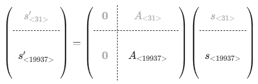

# Is this Twisted?

https://alpacahack.com/daily-bside/challenges/is-this-twisted

## 問題の概要

乱数列が `secrets.randbits` で生成されたものか、それとも `random.getrandbits` で生成されたものかを当てる問題です。

サーバーでは次のように乱数列が生成されています。

```python
bit = secrets.randbelow(2)
a = [secrets.randbits(32) for _ in range(624)]
if bit:
    random.setstate((3, (*a, 624), None))
    a = [random.getrandbits(32) for _ in range(624)]
print(a)
```

`bit` が `0` の場合は `secrets.randbits` で生成された乱数列がそのまま出力されます。

`bit` が `1` の場合は `a` を `random` の内部状態としてセットしてから、`random.getrandbits` で生成された乱数列が出力されます。

出力された乱数列をもとに `bit` が `0` か `1` かを 128 回連続で当てるとフラグが表示されます。

## random モジュールの仕様

`random` は Mersenne Twister を使用しており、内部状態は次のような構造になっています。

```python
(version, (state[0], ..., state[623], index), gauss_next)
```

`index` が `624` であれば、次の乱数を生成する前に `twist` 処理で `state[0]`,..., `state[623]` が更新されます。

その後、`temper(state[index])` (`index` = `0`, ..., `623`) が順に乱数列として出力されます。

## Mersenne Twister の数学

Mersenne Twister の `temper` 処理と `twist` 処理については、それぞれ [Daily 問題 "The Future Path" の Writeup 記事](https://zenn.dev/nozokare/articles/alpaca-daily-20260316-the-future-path) と [B-SIDE 問題 "The past or the future?" の Writeup 記事](https://zenn.dev/nozokare/articles/alpaca-bside-20260323-the-past-or-the-future) で解説しています。

`temper` は $GF(2)^{32} \to GF(2)^{32}$ の線型変換で、逆写像 `untemper` が存在します。

`twist` は $GF(2)^{32 \times 624} \to GF(2)^{32 \times 624}$ の線型変換ですが、これは全単射ではありません。

入力の `state[0]` の下位 31 ビットは出力の計算に使用されず､ `twist` の像 $\mathrm{Im}(\mathtt{twist}) \subset GF(2)^{19968}$ は 19968 - 31 = 19937 次元の部分空間になっています。

すなわち **19968 ビットの出力はすべて独立ではなく、31 ビットは残りの 19937 ビットの線型結合で表されます。**

### 部分空間に属するかどうかの判定

`state[0]`,...,`state[623]` のビットをリトルエンディアン順に並べたベクトルを $s \in GF(2)^{19968}$ とし、`twist` の表現行列 $A \in GF(2)^{19968 \times 19968}$ を用いて $s' = A s$ と状態を更新するとき、



のようになっています。

$A_{<31>}$ は `A[0:31, 31:19968]` にあたる 31×19937 行列、 $A_{<19937>}$ は `A[31:19968, 31:19968]` にあたる 19937×19937 行列です。

$A_{<19937>}$ は可逆で､ $s'$ の先頭の 31 ビット $s_{<31>}'$ と後ろの 19937 ビット $s_{<19937>}'$ は次のような関係式を満たしています。

$$
s'_{<31>} = A_{<31>} (A_{<19937>})^{-1} s'_{<19937>}
$$

したがって、出力された乱数列 `a[]` を `untemper` して得られた $s'$ が上の関係式を満たすかどうかを確認すれば、`twist` が適用された乱数列かどうかを判定できます。

`secrets.randbits` で生成された乱数がたまたまこの関係式を満たす可能性もありますが、31 ビットがすべて一致する確率は $2^{-31}$ と十分に小さいです。

## 解答に使用したコード

`untwist` は $s'$ から $s_{<19937>}$ を求める処理で、これを `twist` しなおして $s'_{<31>}$ が一致するかを確認しています。

```python
from pwn import remote
from mt19937 import twist, untwist, untemper, warmup

warmup() # twist の表現行列 A と A_{<19937>}^{-1} を事前に計算しておく

conn = remote(host, int(port))

import ast

for r in range(128):
    conn.recvuntil(b"/128\n")
    a = ast.literal_eval(conn.recvline().decode())

    state = [untemper(y) for y in a]
    state_untwisted = untwist(state)
    state_retwisted = twist(state_untwisted)

    if state_retwisted[0] == state[0]:
        print(f"{r + 1}/128: mt19937")
        conn.sendline(b"1")
    else:
        print(f"{r + 1}/128: not mt19937")
        conn.sendline(b"0")

print(conn.recvall().decode())
```

"The past or the future?" を解くときに書いた巨大な表現行列 $A$ を求めて処理する実装を流用していますが、計算量的には `twist` 処理の詳細から逆算して `state[0]` だけ計算するほうが効率的でシンプルになると思います。

参考: [過去の内部状態の復元](https://zenn.dev/hk_ilohas/articles/mersenne-twister-previous-state#%E9%81%8E%E5%8E%BB%E3%81%AE%E5%86%85%E9%83%A8%E7%8A%B6%E6%85%8B%E3%81%AE%E5%BE%A9%E5%85%83)
