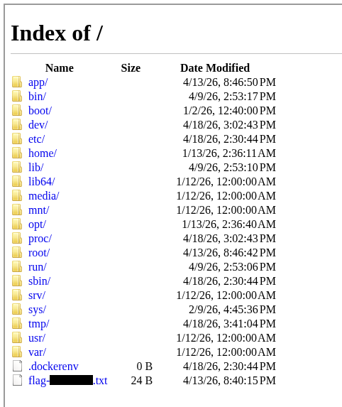

# HTML2PNG

https://alpacahack.com/daily/challenges/html2png

## 問題の概要

HTML を入力して送信すると、サーバーがその HTML を保存したファイル(`/tmp/{uuid}.html`)を Puppeteer で開いてスクリーンショットを撮り、画像を返してくれます。

フラグは `/flag-{hash}.txt` に配置されています。

## 解法

サーバーでは `file:///tmp/{uuid}.html` を Puppeteer で開いているため、ローカルファイルを読み込むことができます。

iframe で `/` のインデックスページを表示させればフラグのファイル名を知ることができます。

```html
<iframe src="file:///" width=800 height=800>
```



フラグのファイル名がわかったら、同様に iframe でフラグのファイルを表示させればフラグを読むことができます。

```html
<iframe src="file:///flag-********.txt" width=800 height=800>
```
