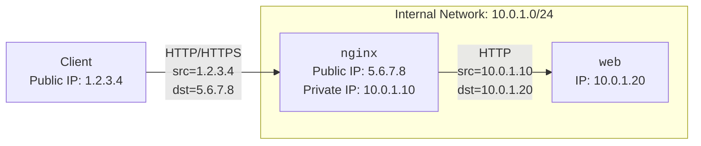

# Flag for localhost

https://alpacahack.com/daily/challenges/flag-for-localhost

## 問題の概要

リバースプロキシとして動作する `nginx` を経由して `web` コンテナに接続する構成の Web アプリケーションが動作しています。

`web` は Express アプリケーションで、`/` にアクセスするとフラグが表示されます。

ただし IP アドレスに基づいてアクセス制御が行われており、ローカルループバックアドレスからのアクセスのみが許可されています。

```js:web/index.js
const app = express();
app.set("trust proxy", true);

const allowedIps = new Set(["127.0.0.1", "::1", "::ffff:127.0.0.1"]);

app.get("/", (req, res) => {
  if (allowedIps.has(req.ip)) {
    res.send(`${FLAG}\n`);
  } else {
    res.status(403).send(`Access from ${req.ip} is not allowed\n`);
  }
});
```

Nginx の設定は以下のようになっています。

```conf:nginx/default.conf
server {
    listen 80;
    location / {
        proxy_pass http://web:3000;

        proxy_set_header Host              $host;
        proxy_set_header X-Forwarded-For   $proxy_add_x_forwarded_for;
        proxy_set_header X-Forwarded-Proto $scheme;
    }
}
```

## `X-Forwarded-For` ヘッダ

一般的に Web アプリケーションのサーバーを構築するとき、接続の入口にリバースプロキシやロードバランサーを配置する構成になることがよくあります。

例えば、以下のような構成を考えます。



この構成では TCP レベルで `web` に接続しているのは `nginx` であるため、`web` から見た接続元の IP アドレスは常に `nginx` のプライベート IP アドレスとなり、クライアントの IP アドレスを直接知ることができません。

そのため、クライアントから直接接続を受ける `nginx` で接続元の情報を HTTP ヘッダに付与して `web` に転送することが一般的です。

今回の問題では Nginx で [`$proxy_add_x_forwarded_for`](https://nginx.org/en/docs/http/ngx_http_proxy_module.html#var_proxy_add_x_forwarded_for) を使って `X-Forwarded-For` ヘッダ (以下 XFF) を設定するようになっています。

`$proxy_add_x_forwarded_for` は、「受信した XFF を引き継ぎ、自分が観測した接続元 IP を追加する」という動作をする変数です。具体的には、受信したリクエストに

- XFF が存在しない場合: `X-Forwarded-For: <接続元 IP>`
- XFF が存在する場合: `X-Forwarded-For: <受信した XFF>, <接続元 IP>`

のように XFF を設定しています。

これは AWS や GCP のロードバランサーのデフォルトの動作と同様で、多段プロキシ構成でどの経路を通ってきたリクエストなのかを追跡することができます。

一般的にアプリケーション側では、

- 受け取った XFF の右から順に信頼できるプロキシの IP アドレスと照合していき、最初に見つかった信頼できない IP アドレスをクライアントの IP アドレスとして扱う
- 手前に存在する XFF を追加するプロキシの数に応じて、右から `n` 番目の IP アドレスをクライアントの IP アドレスとして扱う

などの方法でクライアントの IP アドレスを特定することができます。

## 設定の問題点

今回の問題では Express アプリケーション側では [`"trust proxy"`](https://expressjs.com/en/guide/behind-proxies.html) を `true` に設定しており、XFF をすべて信頼して `req.ip` にクライアントの IP アドレスがセットされるようになっています。

これは最初にクライアントからの接続を受けるプロキシが、受け取った信頼できない XFF ヘッダを引き継がずに `X-Forwarded-For: <接続元 IP>` のように上書きする動作をしているという前提の設定で、XFF の一番左の IP アドレスをクライアントの IP アドレスとして扱うことになります。

しかし、今回の `nginx` の設定では受け取った XFF を引き継いでいるため、クライアントが任意の XFF を付与してリクエストを送ることで IP アドレスを偽装することができてしまいます。

```bash
$ curl -H "X-Forwarded-For: 127.0.0.1" http://...../
Alpaca{0verwrite_X-Forwarded-For_at_the_3dge}
```

## 設定の修正

このような偽装を防ぐためには、プロキシ側とアプリケーション側で IP アドレスを扱う方法を整合させる必要があります。今回の場合は、

最初に接続を受ける Nginx で受け取った XFF を接続元の IP アドレスで上書きする設定にする

```conf:nginx/default.conf
proxy_set_header X-Forwarded-For $remote_addr;
```

もしくは、Express アプリケーション側で信頼するプロキシを限定する

```js:web/index.js
app.set("trust proxy", "uniquelocal");
```

などの対応が必要になります。

## まとめ

プロキシ側とアプリケーション側でクライアントの IP アドレスを扱う設定が異なっているとアクセス元を偽装できてしまうという問題でした。

タイトルや説明文は shiragi さんの [Flag for Switch](https://alpacahack.com/daily/challenges/flag-for-switch) の類問を意識してつけてみました。

こちらもアクセス元の情報を偽装してフラグを取得する Web の問題なので、まだ解いていない方はぜひ挑戦してみてください。
